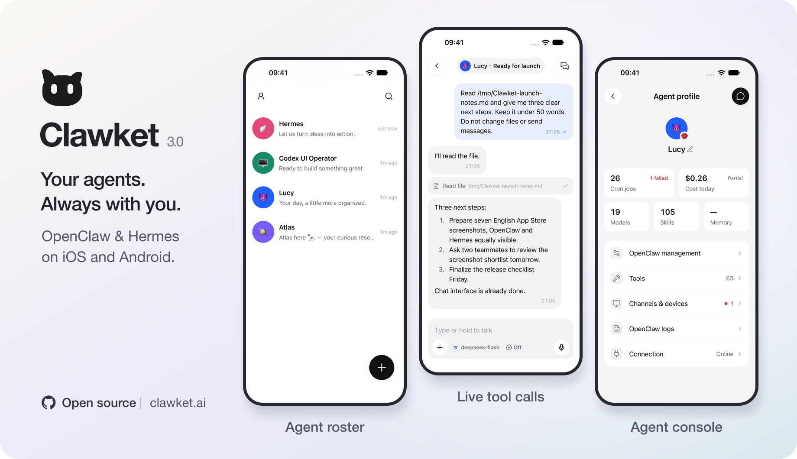

<p align="center">
  
</p>

# Clawket

[](https://www.npmjs.com/package/@p697/clawket)
[](LICENSE)
[Follow me on X](https://x.com/cavano697)

[中文说明](./README.zh-CN.md)

**Your agents. Always with you.**

Clawket is an open-source iOS and Android companion for [OpenClaw](https://github.com/openclaw/openclaw) and [Hermes Agent](https://github.com/NousResearch/hermes-agent). Chat with your agents, follow their tool calls, switch between sessions, and manage their work from your phone.

<table>
  <tr>
    <th>iOS · App Store</th>
    <th>Android · Google Play</th>
  </tr>
  <tr>
    <td align="center"><a href="https://apps.apple.com/app/id6759597015"></a></td>
    <td align="center"><a href="https://play.google.com/store/apps/details?id=com.p697.clawket"></a></td>
  </tr>
  <tr>
    <td align="center"><a href="https://apps.apple.com/app/id6759597015">App Store ↗</a></td>
    <td align="center"><a href="https://play.google.com/store/apps/details?id=com.p697.clawket">Google Play ↗</a></td>
  </tr>
</table>

The screenshots show the new 3.0 interface. Store availability may differ while the release is under review.

## What you can do

- **Keep your agents together.** One roster for agents across your connections, with recent activity and quick access to conversations.
- **Follow the work as it happens.** Streaming replies and detailed tool calls live alongside the conversation.
- **Switch sessions with context.** Find and resume sessions, including those created through channels such as Slack and Telegram when supported by your backend.
- **Manage from the Agent console.** See usage and access models, skills, scheduled tasks, and settings. Controls follow each backend's capabilities.
- **Connect your way.** Use Relay for remote access, or connect over LAN, Tailscale, or your own endpoint. Self-host the infrastructure if you prefer.
- **Use your language.** The app supports 19 interface languages, light and dark themes, and voice input with an optional transcription service.

Clawket connects to agents you run; you need an existing OpenClaw or Hermes installation. Available tools and management features depend on that backend.

## Get connected

Install the mobile app using either store link above. On the computer running your agent, install the Bridge CLI (Node.js 20.3+):

```bash
npm install -g @p697/clawket
clawket pair
```

Scan the generated QR code in Clawket. The CLI detects installed backends and produces a labeled pairing result for each. Relay is the default; Hermes pairing also attempts to start its Clawket-managed bridge and Relay runtime.

For direct pairing on your local network:

```bash
clawket pair local
```

To select a backend explicitly, add `--backend openclaw` or `--backend hermes`. Use `clawket status`, `clawket doctor`, and `clawket logs` to inspect your connection.

## Build from source

Use **Node.js 22.x** and npm for this checkout. iOS development requires macOS and Xcode; Android development requires Android Studio and its SDK.

```bash
npm ci
# Generate only the platform you are developing (Android also works without Xcode):
npm exec --workspace apps/mobile -- expo prebuild --platform ios
npm run mobile:dev:ios
# Or, generate Android and run it:
npm exec --workspace apps/mobile -- expo prebuild --platform android
npm run mobile:dev:android
```

Optional public configuration is documented in [`apps/mobile/.env.example`](./apps/mobile/.env.example). Copy it to `apps/mobile/.env.local` to configure your build. Provider secrets belong on the server, never in `EXPO_PUBLIC_*` values.

Community Debug and Release builds work without analytics, billing or speech configuration. Leave `CLAWKET_OFFICIAL_BUILD` unset; the `production`/`testflight` EAS profiles are for official Clawket distribution. Use your own Apple signing team for a physical device and your own EAS project for cloud builds; see [self-hosting](./docs/self-hosting.md). iOS also requires CocoaPods, and Android requires JDK 17 with `ANDROID_HOME` set.

```bash
npm run mobile:config:show
npm run mobile:config:check
```

Local-model connections are also available for llama.cpp, Ollama, and OpenAI-compatible servers. See the [local-model guide](./docs/3.0/15-local-model.md) for setup and current limitations.

## Connections and self-hosting

In **Relay mode**, the Registry handles pairing and the Relay forwards live WebSocket traffic between the app and your Bridge. Your agent continues to run on your own machine. In **direct mode**, the app reaches your backend endpoint over LAN, Tailscale, or a custom URL without Relay infrastructure.

You can build the mobile app and operate your own services. OpenClaw and Hermes share the Relay implementation but use separate services, storage, and pairing credentials.

- [Self-hosting guide](./docs/self-hosting.md)
- [Relay configuration](./docs/relay/CONFIGURATION.md)
- [Local Relay development](./docs/relay/LOCAL-DEVELOPMENT.md)
- [Relay architecture](./docs/relay/ARCHITECTURE.md)

## Privacy and optional integrations

Relay forwards traffic without persisting message content. The app keeps a local message cache; deleting a connection clears its cache. Your agent backend and model provider retain their own data-handling policies.

Source builds can leave these integrations unconfigured or configure their own services:

| Component | Purpose |
| --- | --- |
| PostHog | Basic usage and diagnostics; analytics events exclude conversation text and prompts. Leave analytics configuration empty to disable it. |
| RevenueCat | Store subscription management. Unconfigured source builds skip billing and unlock Pro features. |
| Alibaba Cloud speech service | Transcribes audio when you use cloud voice input. Configure the independent speech endpoint to enable it; provider keys stay on the server. |

These components are separate from Agent connectivity. See the [configuration example](./apps/mobile/.env.example) and [speech service guide](./docs/3.0/22-voice-input.md) for details. Store builds use their configured integrations; see the [Privacy Policy](https://clawket.ai/privacy).

## Repository

| Path | Purpose |
| --- | --- |
| `apps/mobile` | Expo / React Native app |
| `apps/bridge-cli` | Published `@p697/clawket` CLI |
| `apps/relay-registry` | Pairing Registry Worker |
| `apps/relay-worker` | WebSocket Relay Worker |
| `apps/speech-worker` | Independent cloud transcription service |
| `packages/agent-protocol` | Shared backend contracts and capabilities |
| `packages/bridge-core` | Pairing, configuration, and service helpers |
| `packages/bridge-runtime` | Bridge runtimes |
| `packages/relay-shared` | Shared Relay protocol and types |

## Contributing

Read [CONTRIBUTING.md](./CONTRIBUTING.md). Run the repository's required checks before proposing code changes:

```bash
npm run check:required
```

Live-service and release integration checks have separate prerequisites; see the contributor and workspace documentation. Report security issues as described in [SECURITY.md](./SECURITY.md).

## License

Unless a subdirectory states otherwise, this repository is licensed under [AGPL-3.0-only](./LICENSE).
